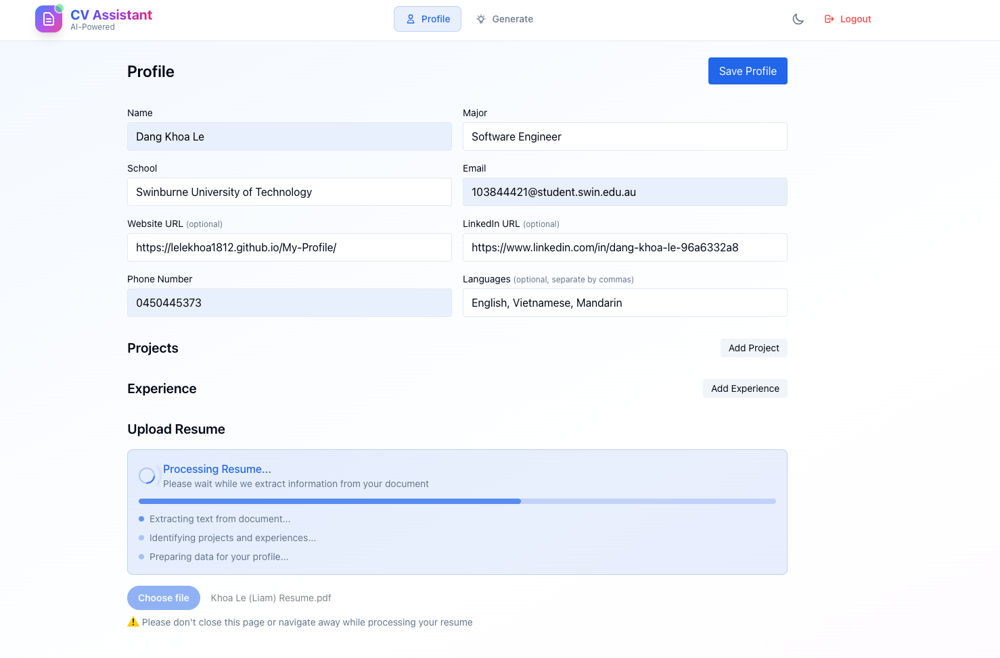
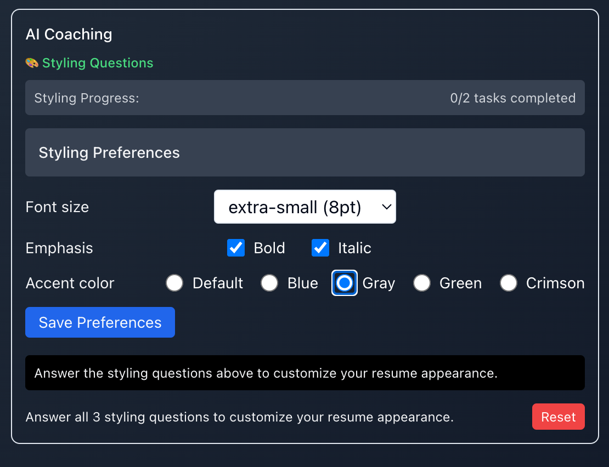
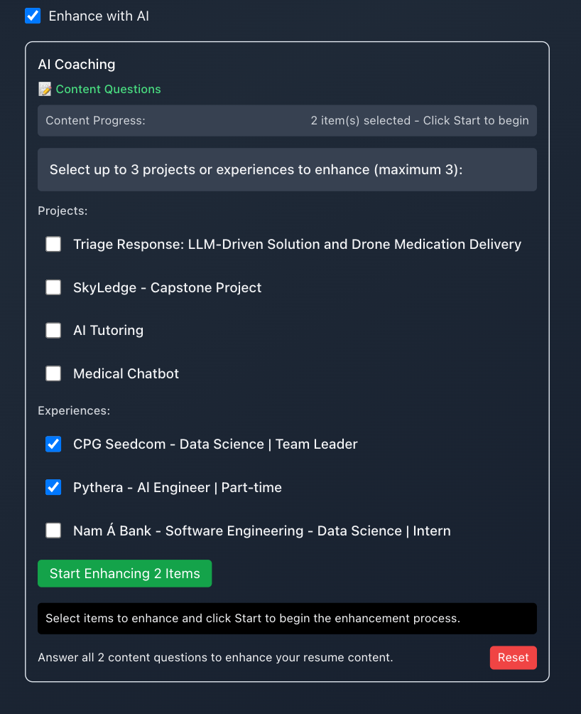

# CV Assistant - AI-Powered Resume & Cover Letter Platform

A comprehensive, modern web application that leverages AI to generate personalized cover letters and build professional resumes. Built with Next.js 15, TypeScript, Tailwind CSS, and powered by Google Gemini AI for intelligent content generation and enhancement.

[CV Assistant Demo](https://cva-mauve.vercel.app/)

## 🚀 Overview

CV Assistant is a full-featured professional development platform that combines AI-powered content generation with intelligent resume building. The application offers two main services:

1. **AI-Powered Cover Letter Generation** - Creates personalized cover letters based on job descriptions and user profiles
2. **Intelligent Resume Builder** - Builds professional resumes with AI coaching for styling and content enhancement

## 📸 Screenshots

### 🏠 Dashboard

*Main dashboard showcasing both cover letter generation and resume customization features*

### 🔐 Authentication

*Secure login and registration interface with modern design*

### 👤 Profile Management

*Leverage OCR and VLM technologies to parse your resume and extract information automatically*


*Comprehensive user profile management with experience, skills, and project management*


*AI-powered enhancement of project and experience descriptions using advanced LLM techniques*

### ✨ Cover Letter Generation

*AI-powered cover letter generation interface with intelligent reasoning and skill matching*

### 📄 Resume Builder

#### Resume Creation Interface

*Main resume builder interface with project/experience selection and AI enhancement options*

#### Styling Customization

*AI coaching for resume styling preferences including font size, bold/italic usage, and layout options*

#### Content Enhancement

*Intelligent selection of up to 3 projects/experiences for targeted content enhancement*


*AI-powered content enhancement with personalized questions for each selected item*


*Once finished with an item, please wait for the system ingest and process your data*


*Once on coaching agent mode, you can't generate, press `Reset` to exit*

#### Completion

*Successfully generated resume with enhanced content and styling preferences applied*

#### Preview
Have a look at our [Resume Sample](https://github.com/Lelekhoa1812/CVA/blob/main/imgsrc/sample.pdf)  
*Give us feedback if you have any thought on improvements*

## ✨ Features

### 🎯 Core Functionality

#### Cover Letter Generation
- **AI-Powered Analysis**: Analyzes job descriptions and user profiles to identify relevant skills and experiences
- **Smart Content Generation**: Creates personalized, professional cover letters in minutes
- **Intelligent Skill Matching**: Automatically selects relevant projects and experiences
- **Real-time Generation**: Instant cover letter creation with copy-to-clipboard functionality

#### Resume Builder
- **Harvard-Style Templates**: Professional, ATS-friendly resume layouts
- **AI Coaching System**: Two-phase intelligent coaching for optimal results
  - **Styling Agent**: Customizes font sizes, bold/italic usage, and layout preferences
  - **Content Agent**: Enhances specific projects/experiences with targeted questions
- **Smart Content Enhancement**: 
  - Format options: Concise (50% shorter), Preserve (current length), Enhance (50% expanded)
  - Personalized modifications: Technical focus, leadership emphasis, metrics addition, ATS optimization
- **Dynamic PDF Generation**: Real-time preview with professional formatting
- **Multi-page Support**: Automatic pagination for comprehensive resumes

### 🎨 User Experience
- **Modern Design**: Beautiful, responsive UI with gradient backgrounds and smooth animations
- **Dark/Light Mode**: Toggle between themes with persistent preferences
- **Professional Styling**: Clean, modern interface that builds trust and credibility
- **Mobile Responsive**: Optimized for all device sizes with hamburger navigation
- **Interactive Elements**: Hover effects, progress indicators, and real-time feedback

### 🔧 Technical Features
- **TypeScript**: Full type safety and better development experience
- **Next.js 15**: Latest features with App Router and Server Components
- **Tailwind CSS**: Utility-first styling with custom design system
- **MongoDB**: Scalable database for user profiles and data storage
- **JWT Authentication**: Secure user authentication and session management
- **Google Gemini AI**: Advanced LLM integration with multiple specialized agents:
  - **Gemini 2.5 Flash**: For content enhancement and markdown beautification
  - **Gemini 2.5 Flash Lite**: For style parsing and content summarization
- **PDF Generation**: Professional PDF creation using pdf-lib
- **OCR Integration**: Resume parsing and information extraction

## 🚀 Quick Start

### Prerequisites
- Node.js 18+ 
- npm or yarn
- MongoDB database
- Google Gemini API key

### Installation

1. **Clone the repository**
   ```bash
   git clone https://github.com/Lelekhoa1812/CVA.git
   cd cv-assistant
   ```

2. **Install dependencies**
   ```bash
   npm install
   ```

3. **Set up environment variables**
   Create a `.env.local` file in the root directory:
   ```env
   # Database
   MONGODB_URI=your_mongodb_connection_string
   
   # Authentication
   JWT_SECRET=your_jwt_secret_key
   
   # Google Gemini AI
   GEMINI_API_KEY=your_gemini_api_key
   
   # Optional: For production
   NEXTAUTH_URL=http://localhost:3000
   NEXTAUTH_SECRET=your_nextauth_secret
   ```

4. **Run the development server**
   ```bash
   npm run dev
   ```

5. **Open your browser**
   Navigate to [http://localhost:3000](http://localhost:3000)

## 📁 Project Structure

```
cv-assistant/
├── src/
│   ├── app/                    # Next.js App Router
│   │   ├── api/               # API routes
│   │   │   ├── auth/         # Authentication endpoints
│   │   │   ├── generate/     # Cover letter generation
│   │   │   ├── enhance/      # Content enhancement
│   │   │   ├── ocr/          # OCR functionality
│   │   │   ├── profile/      # Profile management
│   │   │   └── resume/       # Resume building endpoints
│   │   │       ├── harvard/  # Harvard-style PDF generation
│   │   │       ├── coach/    # AI coaching system
│   │   │       ├── enhance-targeted/ # Targeted content enhancement
│   │   │       ├── style-parser/ # Style preference parsing
│   │   │       ├── beautify/ # Markdown beautification
│   │   │       ├── summarize/ # Content summarization
│   │   │       └── enhance/  # Content expansion
│   │   ├── generate/         # Cover letter generation page
│   │   ├── resume/           # Resume builder page
│   │   ├── login/            # Authentication pages
│   │   ├── profile/          # Profile management page
│   │   ├── globals.css       # Global styles
│   │   └── layout.tsx        # Root layout
│   ├── components/           # Reusable components
│   │   └── Navbar.tsx        # Navigation component with mobile support
│   ├── contexts/             # React contexts
│   │   └── ThemeContext.tsx  # Dark/light mode context
│   └── lib/                  # Utility libraries
│       ├── auth.ts           # Authentication utilities
│       ├── db.ts             # Database connection
│       ├── gemini.ts         # AI integration
│       └── models/           # Database models
├── public/                   # Static assets
├── imgsrc/                   # Application screenshots
│   ├── resume/              # Resume builder screenshots
│   ├── cv/                  # Cover letter screenshots
│   └── profile/             # Profile management screenshots
├── tailwind.config.ts        # Tailwind configuration
├── next.config.ts           # Next.js configuration
└── package.json             # Dependencies and scripts
```

## 🛠️ Configuration

### Tailwind CSS
The project uses a custom design system with CSS variables for consistent theming:

```css
:root {
  --primary: 221.2 83.2% 53.3%;
  --background: 0 0% 100%;
  --foreground: 222.2 84% 4.9%;
  --card: 0 0% 100%;
  --card-foreground: 222.2 84% 4.9%;
  --popover: 0 0% 100%;
  --popover-foreground: 222.2 84% 4.9%;
  --muted: 210 40% 96%;
  --muted-foreground: 215.4 16.3% 46.9%;
  --accent: 210 40% 96%;
  --accent-foreground: 222.2 47.4% 11.2%;
  --destructive: 0 84.2% 60.2%;
  --destructive-foreground: 210 40% 98%;
  --border: 214.3 31.8% 91.4%;
  --input: 214.3 31.8% 91.4%;
  --ring: 221.2 83.2% 53.3%;
  --radius: 0.5rem;
}
```

### Database Schema
The application uses MongoDB with the following main collections:

- **Users**: Authentication and profile information
- **Experiences**: Professional experience entries with enhanced descriptions
- **Projects**: Project portfolio items with AI-enhanced content
- **Skills**: User skills and competencies

## 🎯 Usage Guide

### 1. Getting Started
1. **Register/Login**: Create an account or sign in using the authentication interface
2. **Complete Profile**: Add your professional experience, skills, and projects
3. **Choose Service**: Use either cover letter generation or resume building

### 2. Creating a Cover Letter
1. Navigate to the **Generate** page
2. Enter the **Company Name**
3. Paste the **Job Description**
4. Choose whether to use AI for skill matching
5. Click **Generate Cover Letter**
6. Copy or customize the result

### 3. Building a Resume

#### Step 1: Basic Setup
1. Navigate to the **Resume** page
2. Select up to 7 projects and experiences from your profile
3. Add your skills and expertise
4. Choose AI enhancement options

#### Step 2: AI Coaching (Optional)
1. **Styling Customization**:
   - Font size preferences (10pt, 11pt, 12pt)
   - Bold/italic usage for emphasis
   - Layout and color preferences
   
2. **Content Enhancement**:
   - Select up to 3 specific items to enhance
   - Choose content format (concise/preserve/enhance)
   - Specify modification preferences
   - AI processes each item individually

#### Step 3: Generate PDF
1. Click **Generate PDF** button
2. Preview the generated resume
3. Download or retry if needed

### 4. Profile Management
- **Add Experience**: Include job titles, companies, and descriptions
- **Add Projects**: Showcase your portfolio with detailed descriptions
- **Manage Skills**: List your technical and soft skills
- **Update Information**: Keep your profile current
- **AI Enhancement**: Use AI to improve existing descriptions

## 🔧 Development

### Available Scripts

```bash
# Development
npm run dev          # Start development server
npm run build        # Build for production
npm run start        # Start production server
npm run lint         # Run ESLint

# Vercel (if using Vercel CLI)
npx vercel dev       # Start Vercel development server
npx vercel --prod    # Deploy to production
```

### Code Style
- **TypeScript**: Strict type checking enabled
- **ESLint**: Configured with Next.js recommended rules
- **Prettier**: Code formatting (recommended)

### Environment Variables
| Variable | Description | Required |
|----------|-------------|----------|
| `MONGODB_URI` | MongoDB connection string | Yes |
| `JWT_SECRET` | JWT signing secret | Yes |
| `GEMINI_API_KEY` | Google Gemini API key | Yes |
| `NEXTAUTH_URL` | Application URL | No |
| `NEXTAUTH_SECRET` | NextAuth secret | No |

## 🚀 Deployment

### Vercel (Recommended)
1. **Connect Repository**: Link your GitHub repository to Vercel
2. **Set Environment Variables**: Add all required environment variables
3. **Deploy**: Vercel will automatically build and deploy your app

### Manual Deployment
1. **Build the application**:
   ```bash
   npm run build
   ```

2. **Start the production server**:
   ```bash
   npm run start
   ```

### Docker (Optional)
```dockerfile
FROM node:18-alpine
WORKDIR /app
COPY package*.json ./
RUN npm ci --only=production
COPY . .
RUN npm run build
EXPOSE 3000
CMD ["npm", "start"]
```

## 🔒 Security

### Authentication
- JWT-based authentication
- Secure password hashing with bcrypt
- Protected API routes

### Data Protection
- Input validation and sanitization
- MongoDB injection protection
- Secure environment variable handling

### API Security
- Rate limiting (recommended for production)
- CORS configuration
- Request validation

## 🤝 Contributing

1. **Fork the repository**
2. **Create a feature branch**: `git checkout -b feature/amazing-feature`
3. **Commit your changes**: `git commit -m 'Add amazing feature'`
4. **Push to the branch**: `git push origin feature/amazing-feature`
5. **Open a Pull Request**

### Development Guidelines
- Follow TypeScript best practices
- Write meaningful commit messages
- Add tests for new features
- Update documentation as needed

## 📝 API Documentation

### Authentication Endpoints
- `POST /api/auth/register` - User registration
- `POST /api/auth/login` - User login
- `POST /api/auth/logout` - User logout

### Profile Endpoints
- `GET /api/profile` - Get user profile
- `POST /api/profile` - Update user profile

### Cover Letter Generation
- `POST /api/generate/cover-letter` - Generate cover letter
- `POST /api/generate/select` - Select relevant items

### Resume Building
- `POST /api/resume/harvard` - Generate Harvard-style PDF resume
- `POST /api/resume/coach` - AI coaching system
- `POST /api/resume/enhance-targeted` - Targeted content enhancement
- `POST /api/resume/style-parser` - Parse styling preferences
- `POST /api/resume/beautify` - Markdown beautification
- `POST /api/resume/summarize` - Content summarization
- `POST /api/resume/enhance` - Content expansion

### Content Enhancement
- `POST /api/enhance` - General content enhancement
- `POST /api/ocr` - Resume parsing and OCR

## 🐛 Troubleshooting

### Common Issues

**Build Errors**
- Ensure all environment variables are set
- Check Node.js version (18+ required)
- Clear `.next` cache: `rm -rf .next`

**Database Connection**
- Verify MongoDB URI format
- Check network connectivity
- Ensure database permissions

**AI Generation Issues**
- Verify Gemini API key
- Check API quota limits
- Review request format

**PDF Generation Issues**
- Check if selected items have content
- Verify styling preferences are set
- Ensure proper content enhancement completion

### Performance Optimization
- Enable Next.js caching
- Optimize images and assets
- Use CDN for static files
- Implement database indexing

## 🔮 Future Features

### Planned Enhancements
- **Multiple Resume Templates**: Additional professional styles
- **Advanced AI Coaching**: More sophisticated content enhancement
- **Export Options**: Multiple format support (Word, LaTeX)
- **Collaboration**: Team resume building and review
- **Analytics**: Resume performance tracking and optimization

### AI Improvements
- **Multi-language Support**: Resume generation in multiple languages
- **Industry-specific Optimization**: Tailored content for different sectors
- **Real-time Feedback**: Live suggestions during content creation

## 📄 License

This project is licensed under the MIT License - see the [LICENSE](https://github.com/Lelekhoa1812/CVA/blob/main/LICENSE.txt) file for details.

## 📞 Support

- **Issues**: [GitHub Issues](https://github.com/Lelekhoa1812/CVA/issues)
- **Discussions**: [GitHub Discussions](https://github.com/Lelekhoa1812/CVA/discussions)
- **Email**: binkhoa1812@gmail.com

---

*Transform your professional presence with AI-powered resume building and cover letter generation that stands out to employers.*

**Built with ❤️ using Next.js, TypeScript, and Google Gemini AI**
